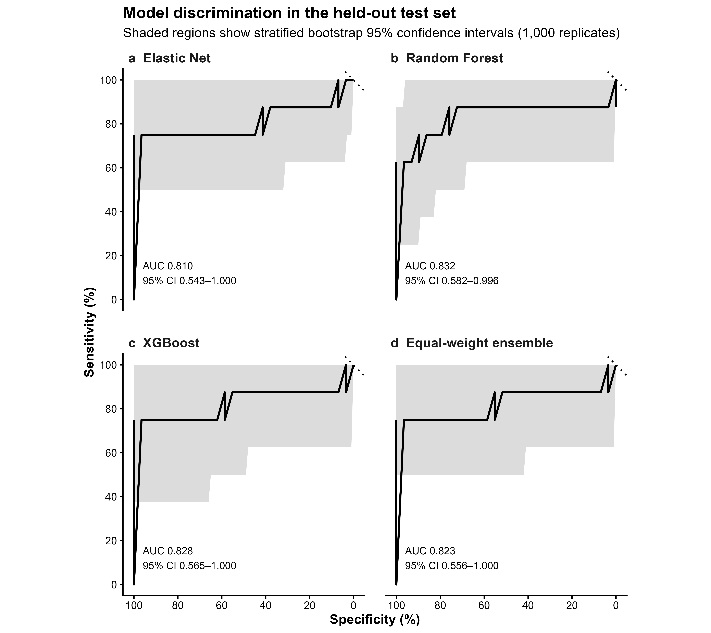
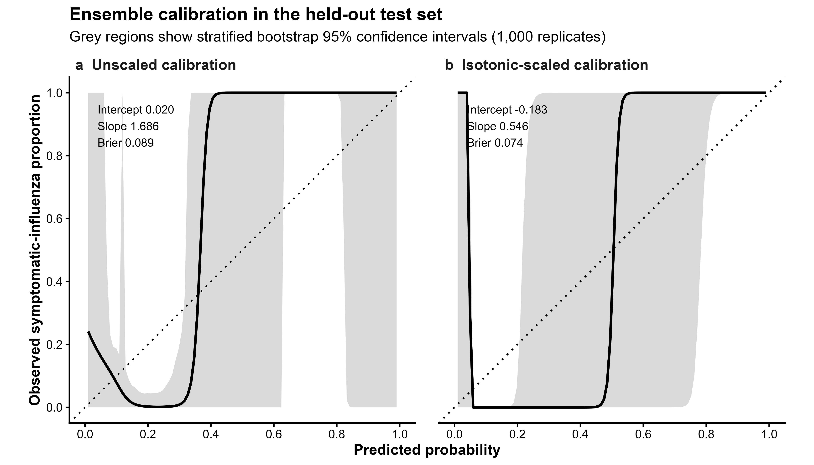
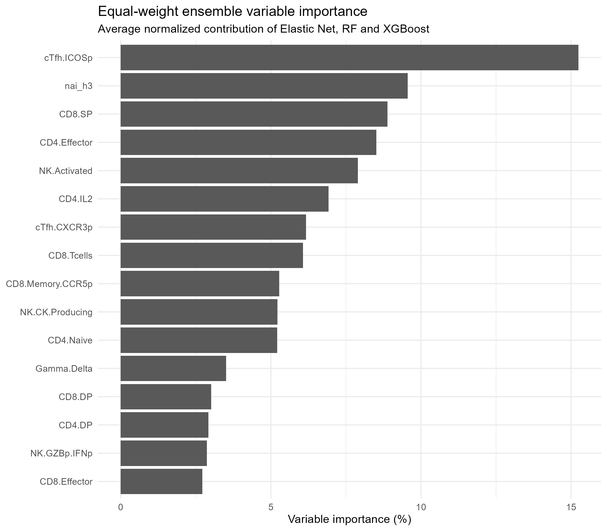

# Influenza Immune Prediction

Machine-learning analysis for predicting **symptomatic influenza** from baseline immune-profile measurements.

The workflow compares:

- Elastic Net logistic regression
- Random Forest
- XGBoost
- An equal-weight ensemble of the three models

The project uses repeated cross-validation for model development and a held-out test set for one final evaluation.

---

## Study workflow

After complete-case filtering, the modelling dataset contained:

- **171 participants**
- **16 immune predictors**
- **134 participants in the training set**
- **37 participants in the held-out test set**
- **28 symptomatic cases in training**
- **8 symptomatic cases in testing**

The outcome was:

- `Positive`: symptomatic influenza
- `Negative`: protected control

The analysis followed this structure:

```text
Raw data
   ↓
Data cleaning and participant exclusions
   ↓
16-predictor modelling table
   ↓
Complete-case dataset: 171 participants
   ↓
Training set: 134        Held-out test set: 37
   ↓                              ↓
Repeated 5-fold CV               Used once only
   ↓                              ↓
Elastic Net, RF, XGBoost, ensemble
   ↓
Threshold selection using Youden's index
   ↓
Final held-out test evaluation
```

---

## Important methodological note

The 16 predictors used in this project were selected from the variable-importance results reported in the source influenza study.

Therefore, this analysis should be interpreted as an **exploratory replication and extension**, not as fully independent feature discovery or external validation.

For a new dataset without a published feature list, feature selection should be performed using the training data only, ideally within nested or repeated cross-validation.

The held-out test set was not used for:

- feature selection
- hyperparameter tuning
- threshold selection
- ensemble construction
- isotonic calibration fitting

---

## Repository structure

```text
influenza-immune-prediction/
├── R/                  # Analysis scripts
├── data/
│   ├── raw/            # Local raw data; not committed
│   └── processed/      # Generated processed data; not committed
├── models/             # Fitted models; not committed
├── results/            # Selected summary tables and figures
├── .gitignore
├── README.md
└── influenza-immune-prediction.Rproj
```

Participant-level data, fitted models and participant-level prediction files are intentionally excluded from GitHub.

---

## Selected predictors

The following 16 immune variables were used:

```r
selected_predictors <- c(
  "cTfh.ICOSp",
  "CD4.Effector",
  "cTfh.CXCR3p",
  "CD4.IL2",
  "CD8.Effector",
  "NK.Activated",
  "CD8.Memory.CCR5p",
  "NK.GZBp.IFNp",
  "CD4.Naive",
  "nai_h3",
  "CD8.SP",
  "CD4.DP",
  "NK.CK.Producing",
  "CD8.DP",
  "Gamma.Delta",
  "CD8.Tcells"
)
```

---

## R requirements

The main packages used are:

```r
install.packages(c(
  "caret",
  "glmnet",
  "ranger",
  "xgboost",
  "dplyr",
  "tidyr",
  "tibble",
  "pROC",
  "ggplot2"
))
```

XGBoost is trained directly with the native `xgboost` package because current XGBoost 3.x releases are not fully compatible with `caret::train(method = "xgbTree")`.

---

## Running the analysis

Open the R project from the repository root and run the scripts in numerical order.

### 1. Data preparation

```r
source("R/prepare_influenza_data.R")
source("R/02_build_modelling_table.R")
source("R/03_create_complete_case_data.R")
source("R/04_prepare_train_test.R")
```

These scripts:

- clean the source data
- remove predefined outlier participants
- construct the 16-predictor modelling table
- remove participants with incomplete predictor profiles
- create the fixed training and held-out test datasets

### 2. Elastic Net

```r
source("R/05_train_elastic_net.R")
source("R/06_evaluate_elastic_net_cv.R")
```

### 3. Random Forest

```r
source("R/07_train_random_forest.R")
source("R/08_evaluate_random_forest_cv.R")
```

### 4. XGBoost

```r
source("R/09_train_xgboost_native.R")
```

### 5. Ensemble

```r
source("R/10_build_cv_ensemble.R")
```

The ensemble probability is:

```text
(Elastic Net probability + Random Forest probability + XGBoost probability) / 3
```

### 6. Final held-out test evaluation

```r
source("R/11_evaluate_external_test.R")
```

Despite the legacy filename, this is a **held-out test evaluation**, not validation in an independent external cohort.

After running this script, model selection and thresholds must not be changed based on test performance.

### 7. Calibration and variable importance

```r
source("R/12_calibration_analysis.R")
source("R/13_variable_importance.R")
```

### 8. Publication figures

```r
source("R/14_publication_performance_figures.R")
```

---

## Cross-validated training performance

Thresholds were selected from averaged out-of-fold training predictions using **Youden's index**.

| Model | Threshold | ROC AUC | Sensitivity | Specificity | Balanced accuracy |
|---|---:|---:|---:|---:|---:|
| Random Forest | 0.275 | 0.857 | 0.786 | 0.906 | 0.846 |
| Equal-weight ensemble | 0.261 | 0.857 | 0.786 | 0.925 | 0.855 |
| XGBoost | 0.392 | 0.849 | 0.679 | 0.953 | 0.816 |
| Elastic Net | 0.300 | 0.827 | 0.679 | 0.972 | 0.825 |

The ensemble produced the highest cross-validated balanced accuracy, while Random Forest produced the highest cross-validated AUC.

---

## Held-out test performance

The held-out test set contained 37 participants:

- 8 symptomatic cases
- 29 protected controls

| Model | ROC AUC | Sensitivity | Specificity | Balanced accuracy | Accuracy |
|---|---:|---:|---:|---:|---:|
| Random Forest | 0.832 | 0.750 | 0.897 | 0.823 | 0.865 |
| XGBoost | 0.828 | 0.750 | 0.931 | 0.841 | 0.892 |
| Equal-weight ensemble | 0.823 | 0.750 | 0.897 | 0.823 | 0.865 |
| Elastic Net | 0.810 | 0.750 | 1.000 | 0.875 | 0.946 |

All models identified 6 of the 8 symptomatic cases.

Random Forest had the highest test AUC. Elastic Net had the highest threshold-based balanced accuracy and produced no false-positive classifications in this small test set.

Because the test set contained only eight positive cases, confidence intervals were wide and differences between models should not be overinterpreted.

---

## Calibration

Calibration was evaluated using averaged out-of-fold training predictions.

| Model | Brier score | Calibration intercept | Calibration slope | HL P-value |
|---|---:|---:|---:|---:|
| Elastic Net | 0.111 | 0.004 | 2.277 | 0.030 |
| Random Forest | 0.088 | -0.048 | 1.466 | 0.016 |
| XGBoost | 0.090 | 0.100 | 1.004 | 0.096 |
| Equal-weight ensemble | 0.091 | 0.011 | 1.746 | 0.042 |

XGBoost had the calibration slope closest to the ideal value of 1. Random Forest had the lowest Brier score.

Isotonic scaling was explored for the ensemble. It improved the Brier score in the held-out test set but did not consistently improve all calibration measures. The unscaled probabilities therefore remain the primary output, and the isotonic results should be treated as exploratory.

---

## Variable importance

Model-specific importance measures were normalized to sum to 100% within each model.

- Elastic Net: absolute standardized coefficient
- Random Forest: permutation importance
- XGBoost: gain
- Ensemble: equal-weight mean of the three normalized importance values

The five most influential ensemble predictors were:

| Predictor | Ensemble importance |
|---|---:|
| `cTfh.ICOSp` | 15.24% |
| `nai_h3` | 9.56% |
| `CD8.SP` | 8.88% |
| `CD4.Effector` | 8.51% |
| `NK.Activated` | 7.90% |

These values describe predictive importance and should not be interpreted as causal effects.

---

## Main figures

### Held-out test ROC curves



### Ensemble calibration before and after isotonic scaling



### Ensemble variable importance



---

## Main result files

Public summary outputs currently included in the repository:

```text
results/cv_model_comparison.csv
results/external_test_model_comparison.csv
results/calibration_training_all_models.csv
results/variable_importance_table_publication.csv
results/Figure_2_ROC_test.png
results/Figure_3_calibration_test.png
results/ensemble_variable_importance.png
```

Participant-level predictions are not committed.

---

## Reproducibility and data privacy

The repository contains analysis code and selected aggregate results.

The following are kept local:

- raw participant data
- processed participant data
- fitted model objects
- cross-validation prediction tables containing participant-level rows
- held-out test prediction tables containing participant-level rows

To reproduce the analysis, place the source dataset in `data/raw/` and run the scripts in order.

---

## Interpretation

This project demonstrates that baseline immune-profile variables can discriminate between symptomatic influenza and protected controls with moderate-to-good performance.

The main limitations are:

- small number of symptomatic cases
- complete-case analysis
- predictors selected using results from the same source study
- no independent external validation cohort
- wide uncertainty around held-out test estimates

The results should therefore be considered exploratory and require validation in a larger independent cohort.
